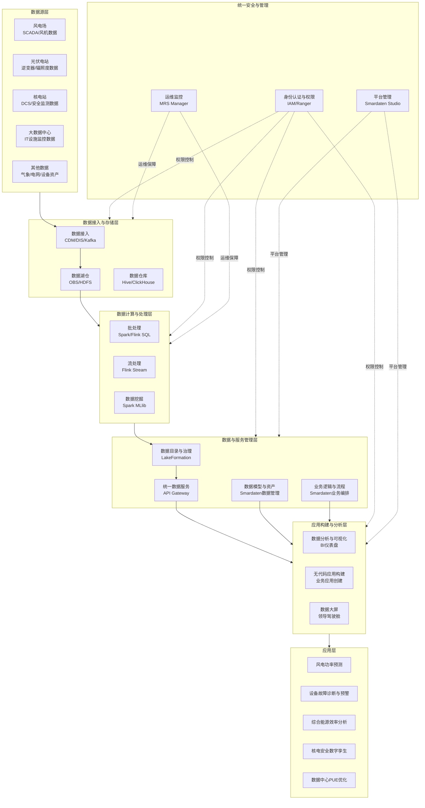

markdown

```mermaid
graph TD
    subgraph A [数据源层]
        direction LR
        A1[风电场<br>SCADA/风机数据]
        A2[光伏电站<br>逆变器/辐照度数据]
        A3[核电站<br>DCS/安全监测数据]
        A4[大数据中心<br>IT设施监控数据]
        A5[其他数据<br>气象/电网/设备资产]
    end

    subgraph B [数据接入与存储层]
        B1[数据接入<br>CDM/DIS/Kafka]
        B2[数据湖仓<br>OBS/HDFS]
        B3[数据仓库<br>Hive/ClickHouse]
    end

    subgraph C [数据计算与处理层]
        C1[批处理<br>Spark/Flink SQL]
        C2[流处理<br>Flink Stream]
        C3[数据挖掘<br>Spark MLlib]
    end

    subgraph D [数据与服务管理层]
        D1[数据目录与治理<br>LakeFormation]
        D2[统一数据服务<br>API Gateway]
        D3[数据模型与资产<br>Smardaten数据管理]
        D4[业务逻辑与流程<br>Smardaten业务编排]
    end

    subgraph E [应用构建与分析层]
        E1[数据分析与可视化<br>BI仪表盘]
        E2[无代码应用构建<br>业务应用创建]
        E3[数据大屏<br>领导驾驶舱]
    end

    subgraph F [应用层]
        F1[风电功率预测]
        F2[设备故障诊断与预警]
        F3[综合能源效率分析]
        F4[核电安全数字孪生]
        F5[数据中心PUE优化]
    end

    subgraph G [统一安全与管理]
        G1[身份认证与权限<br>IAM/Ranger]
        G2[运维监控<br>MRS Manager]
        G3[平台管理<br>Smardaten Studio]
    end

    A --> B1
    B1 --> B2
    B2 --> C
    C --> D1
    D1 --> D2
    D2 --> E
    D3 --> E
    D4 --> E
    E --> F
    
    G1 -.->|权限控制| B
    G1 -.->|权限控制| C
    G1 -.->|权限控制| D
    G1 -.->|权限控制| E

    G2 -.->|运维保障| B
    G2 -.->|运维保障| C

    G3 -.->|平台管理| D
    G3 -.->|平台管理| E

```
