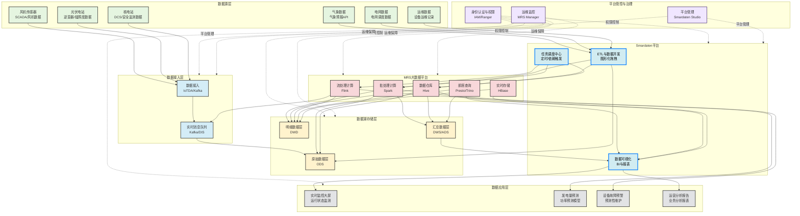

markdown

```mermaid
graph TD
    %% ------------------- Style Definitions -------------------
    classDef source fill:#E5F5E0,stroke:#333,stroke-width:2px;
    classDef ingest fill:#D4EDF7,stroke:#333,stroke-width:2px;
    classDef storage fill:#FFF3CD,stroke:#333,stroke-width:2px;
    classDef mrs fill:#F8D7DA,stroke:#333,stroke-width:2px;
    classDef smardaten fill:#D1ECF1,stroke:#007bff,stroke-width:3px,color:#000;
    classDef app fill:#E2E3E5,stroke:#333,stroke-width:2px;
    classDef governance fill:#f0e6ff,stroke:#563d7c,stroke-width:2px;

    %% ------------------- 数据源层 -------------------
    subgraph A [数据源层]
        direction LR
        A1[风机传感器<br>SCADA/风机数据]
        A2[光伏电站<br>逆变器/辐照度数据]
        A3[核电站<br>DCS/安全监测数据]
        A4[气象数据<br>气象预报API]
        A5[电网数据<br>电网调度数据]
        A6[运维数据<br>设备运维记录]
    end
    class A1,A2,A3,A4,A5,A6 source;

    %% ------------------- 数据接入层 -------------------
    subgraph B [数据接入层]
        B1[数据接入<br>IoTDA/Kafka]
        B2[实时消息队列<br>Kafka/DIS]
    end
    class B1,B2 ingest;

    %% ------------------- 数据湖存储层 -------------------
    subgraph C [数据湖存储层]
        direction TB
        C1[原始数据层<br>ODS]
        C2[明细数据层<br>DWD]
        C3[汇总数据层<br>DWS/ADS]
    end
    class C1,C2,C3 storage;
    
    %% ------------------- MRS大数据平台 -------------------
    subgraph D [MRS大数据平台]
        direction LR
        D1[批处理计算<br>Spark]
        D2[流处理计算<br>Flink]
        D3[数据仓库<br>Hive]
        D4[即席查询<br>Presto/Trino]
        D5[实时存储<br>HBase]
    end
    class D,D1,D2,D3,D4,D5 mrs;

    %% ------------------- Smardaten平台 -------------------
    subgraph SM [Smardaten平台]
        direction TB
        SM1[ETL与数据开发<br>图形化拖拽]
        SM2[任务调度中心<br>定时/依赖触发]
        SM3[数据可视化<br>BI与报表]
    end
    class SM,SM1,SM2,SM3 smardaten;

    %% ------------------- 数据应用层 -------------------
    subgraph E [数据应用层]
        E1[实时监控大屏<br>运行状态监测]
        E2[发电量预测<br>功率预测模型]
        E3[设备故障预警<br>预测性维护]
        E4[运营分析报告<br>业务分析报表]
    end
    class E1,E2,E3,E4 app;
    
    %% ------------------- 平台管控与治理 -------------------
    subgraph F [平台管控与治理]
        direction LR
        F1[身份认证与权限<br>IAM/Ranger]
        F2[运维监控<br>MRS Manager]
        F3[平台管理<br>Smardaten Studio]
    end
    class F1,F2,F3 governance;

    %% ------------------- 数据流连接 -------------------
    A1 --> B1
    A2 --> B1
    A3 --> B1
    A4 --> SM1
    A5 --> SM1
    A6 --> SM1
    
    B1 --> B2
    B2 --> C1
    SM1 --> C1
    
    D1 --> C1
    D1 --> C2
    D1 --> C3
    D3 --> C1
    D3 --> C2
    D3 --> C3
    D2 --> B2
    D2 --> C2
    D4 --> C2
    D4 --> C3
    D5 --> C2
    
    SM1 --> D1
    SM1 --> D3
    SM2 --> D1
    SM2 --> D2
    SM2 --> D3
    
    D4 --> SM3
    D3 --> SM3
    D5 --> SM3
    C3 --> SM3
    
    SM3 --> E1
    SM3 --> E4
    D1 --> E2
    D2 --> E3
    
    %% ------------------- 管控连接 -------------------
    F1 -.->|权限控制| B
    F1 -.->|权限控制| C
    F1 -.->|权限控制| D
    F1 -.->|权限控制| SM
    
    F2 -.->|运维保障| B
    F2 -.->|运维保障| C
    F2 -.->|运维保障| D
    
    F3 -.->|平台管理| SM
    F3 -.->|平台管理| E
```
