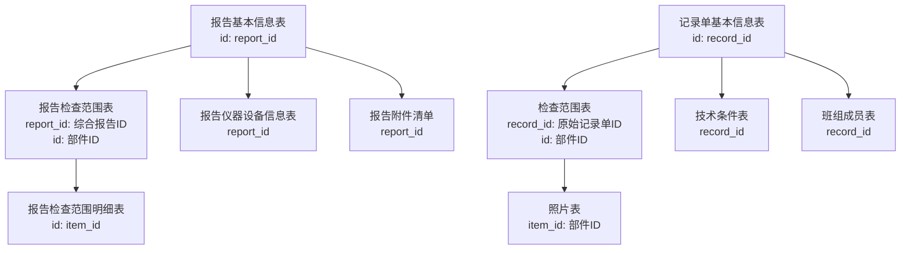

```mermaid
graph TD
    A1[报告基本信息表<br/>id: report_id] --> B1[报告检查范围表<br/>report_id: 综合报告ID<br/>id: 部件ID]
    B1 --> C1[报告检查范围明细表<br/>id: item_id]
    A1 --> D1[报告仪器设备信息表<br/>report_id]
    A1 --> E1[报告附件清单<br/>report_id]

    A2[记录单基本信息表<br/>id: record_id] --> B2[检查范围表<br/>record_id: 原始记录单ID<br/>id: 部件ID]
    A2 --> C2[技术条件表<br/>record_id]
    B2 --> D2[照片表<br/>item_id: 部件ID]
    A2 --> E2[班组成员表<br/>record_id]
```
