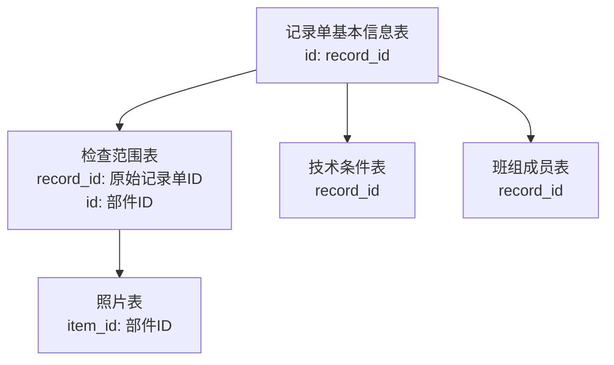

```mermaid
graph TD
    %% 第二组：记录单相关表
    A2[记录单基本信息表<br/>id: record_id] --> B2[检查范围表<br/>record_id: 原始记录单ID<br/>id: 部件ID]
    A2 --> C2[技术条件表<br/>record_id]
    B2 --> D2[照片表<br/>item_id: 部件ID]
    A2 --> E2[班组成员表<br/>record_id]
```
